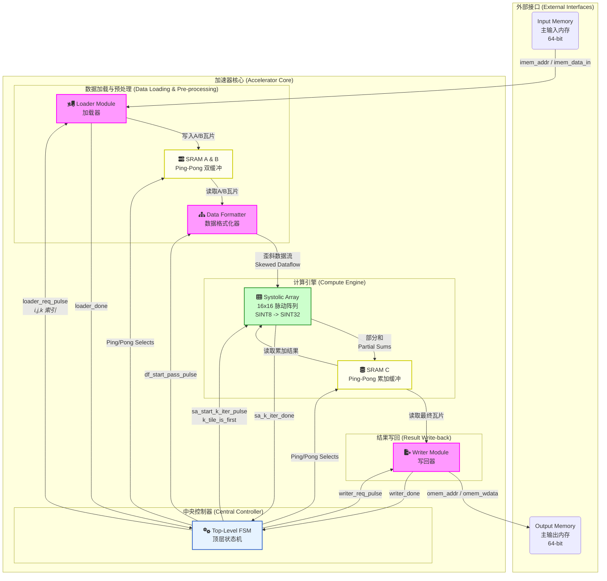

当然！这是一个基于你的设计精心绘制的Markdown架构图，它清晰地展示了数据流、控制流和关键模块。

### 矩阵乘法加速器架构

这是一个用于执行通用矩阵乘法（GEMM）的高性能、可综合的硬件加速器。其核心设计思想是利用脉动阵列（Systolic Array）进行大规模并行计算，并通过深度流水线和双缓冲（Ping-Pong Buffering）机制来隐藏内存访问延迟，最大化计算单元的利用率。

### 架构组件详解

1.  **中央控制器 (Central Controller - FSM)**
    *   **角色**: 整个加速器的大脑，通过一个精心设计的有限状态机（FSM）来协调所有模块的工作。
    *   **功能**:
        *   实现 `C = A * B` 的三重瓦片循环（i-j-k loops）。
        *   生成控制信号（`_req`、`_start` 脉冲）来启动各个数据通路模块。
        *   根据 `_done` 状态信号来推进流水线和循环。
        *   管理所有SRAM Ping-Pong缓冲区的读写选择，确保数据在加载、计算和写回之间无缝切换。

2.  **数据加载与预处理 (Data Loading & Pre-processing)**
    *   **加载器 (Loader)**: 负责从主输入内存（`Input Memory`）中根据顶层FSM提供的瓦片索引（`i,j,k`）读取`A`和`B`矩阵的瓦片数据。
    *   **SRAM A & B**: 两组（A和B）Ping-Pong双缓冲SRAM。每组包含一个Ping和一个Pong缓冲。
        *   **工作模式**: 当计算单元正在从Pong缓冲中读取第`k`个瓦片时，Loader可以同时将第`k+1`个瓦片写入Ping缓冲，实现了加载和计算的并行，这是隐藏内存延迟的关键。
        *   **数据布局**: SRAM被设计为Banked Memory，以支持`Data Formatter`一次性读取一整行或一整列数据。
    *   **数据格式化器 (Data Formatter)**: 从SRAM A/B中读取瓦片数据，并将其转换为脉动阵列所需的歪斜（Skewed）格式。它为每个PE在正确的时钟周期送上正确的数据，是脉动阵列正常工作的前提。

3.  **计算引擎 (Compute Engine)**
    *   **脉动阵列 (Systolic Array)**: 加速器的核心计算单元。一个 `16x16` 的二维阵列，由256个处理单元（PE）组成。
        *   **数据流**: 矩阵`A`的数据从上到下流动，矩阵`B`的数据从左到右流动，部分和（Partial Sums）则固定在每个PE内部进行累加。
        *   **计算**: 每个PE在一个周期内执行一次 `SINT8 * SINT8 + SINT32 -> SINT32` 的乘加（MAC）操作。
    *   **SRAM C**: 用于存储中间和最终累加结果的Ping-Pong缓冲。
        *   **累加反馈**: 在计算一个C瓦片（需要多次k迭代）时，脉动阵列会将`k`次迭代计算出的部分和写回SRAM C，然后在下一次（`k+1`）迭代开始时，再从SRAM C中读出之前的结果进行累加。`k_tile_is_first`信号用于控制在第一次迭代时是清零还是累加。

4.  **结果写回 (Result Write-back)**
    *   **写回器 (Writer)**: 当一个C瓦片的计算完全结束后（所有k次迭代完成），该模块负责从SRAM C中读取最终的`16x16xSINT32`结果，并将其通过64位总线写回到主输出内存（`Output Memory`）。
    *   **高性能设计**: 采用深度流水线设计，能够实现每个周期向主存写入一个64位字，确保写回阶段不会成为性能瓶颈。

### 工作流程与流水线

整个加速器的工作流程被组织成一个三级流水线：**加载 (Load) - 计算 (Compute) - 写回 (Write-back)**。

1.  **初始阶段**: FSM启动`Loader`加载第一个C瓦片所需的第一组A、B瓦片（例如 Ai,0 和 B0,j）。
2.  **流水线稳定阶段**:
    *   **计算单元 (SA)** 正在处理第 `k` 次迭代（使用 Ai,k 和 Bk,j）。
    *   **加载单元 (Loader)** **同时**在主存中预取第 `k+1` 次迭代所需的数据（Ai,k+1 和 Bk+1,j），并存入空闲的Ping/Pong缓冲。
    *   这个过程不断重复，直到一个C瓦片的所有k次迭代完成。
3.  **收尾阶段**:
    *   最后一个C瓦片计算完成后，FSM启动`Writer`模块，将SRAM C中的最终结果写回主存。
    *   在写回Ci,j的同时，FSM可以启动下一组C瓦片（如Ci,j+1）的初始加载，实现了瓦片间的流水线操作。

这个架构通过在空间（脉动阵列）和时间（流水线、双缓冲）上实现高度并行，从而高效地完成了大规模矩阵乘法任务。